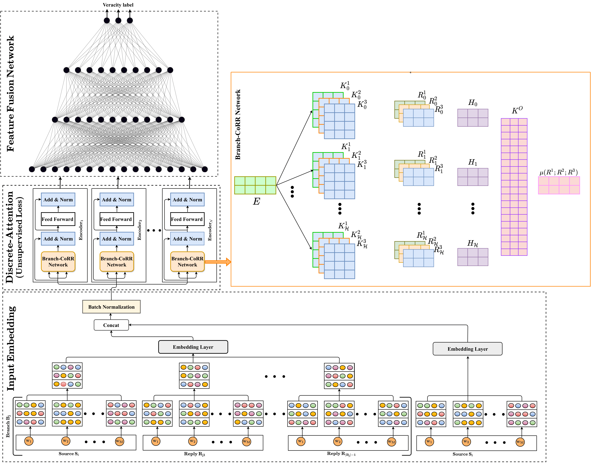

# gDART: Improving Rumor Verification in Social Media with Discrete Attention Representations
## Introduction
gDART is capable of capturing multifarious correlations veiled among the sequence of words which existing DNN models including Transformer often overlook. Our proposed framework uses a Branch-CoRR Attention Network to extract highly informative features in branches, and employs Feature Fusion Network Component to identify deep embedded features and use them to make enhanced identification of veracity of an unverified claim.

## Installation

### Prerequisite
----------------------
Python >= 3.6.
Anaconda 3

### Create Environment
Type the following command to create the environment "myenv" which contains all the required packages.
conda env create -f myenv.yml

-----------------------

## Details

### Details of gDART folder
 * The main model is kept inside the folder "gDART". Neural network model is written in "rumour_Transformer.py" which in turn invoke MHA.py where the actual MHA code is residing.
 * Execute "trainTestModel_Fast.py" file inside this folder to initite the program.
 * Results and required files will be saved under "repo_Fast" folder.
 * Then Execute "resCal.py" file to get the Accuracy and Macro F score.

### Details of gDART∼Src folder
 * This folder contains the variant "gDART∼Src" which does not contain source as an input.
 * Follow the similar steps of gDART model to execute this variant

### Details of gDART∼Unsupervised Loss folder
 * This folder contains the variant "gDART∼Unsupervised Loss" which does not consider the unsupervised loss.
 * Follow the similar steps of gDART model to execute this variant

### Details of gDART∼Encoder+Dense folder
 * This folder contains the variant "gDART∼Encoder+Dense" which substitutes all the Encoders with Dense layers.
 * Follow the similar steps of gDART model to execute this variant

### Details of lDART folder
 * This folder contains the variant "lDART".
 * lDART uses a stack of Encoders while leveraging the unique contextual correlations inside the final Encoder.
 * Follow the similar steps of gDART model to execute this variant

### Details of gDART(BERT-fine tune) folder
 * This folder contains the implementaion of gDART with the pre-trained Fine-tuing BERT model.
 * We use BERT BASE version which has 12 encoders, 12 12 attention heads.

### Results
 * Additional Results are kept inside the "Results" folder.
 * 

## gDART Architecture

